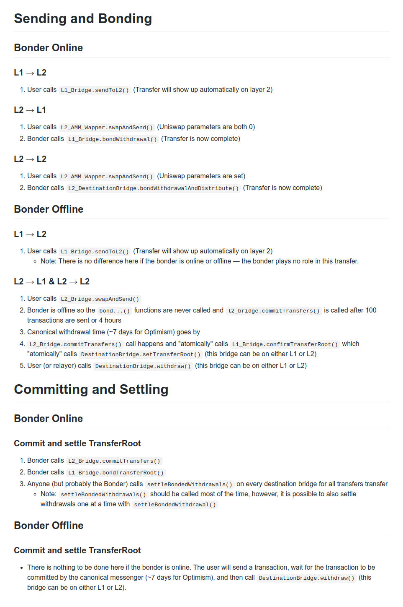
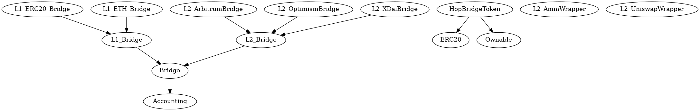
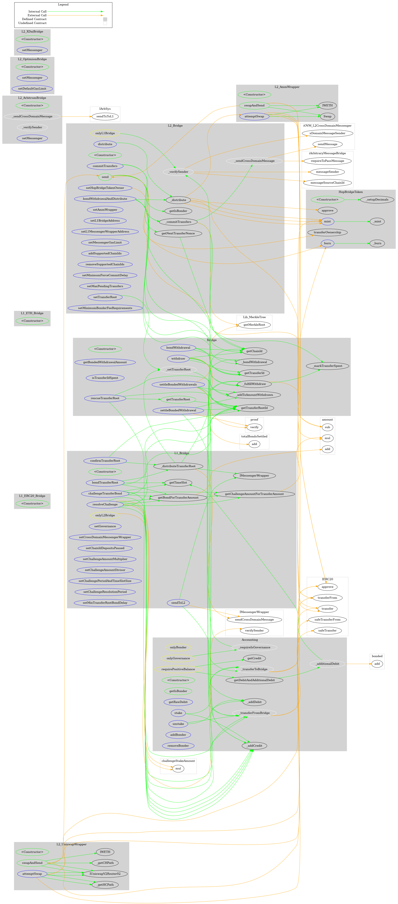
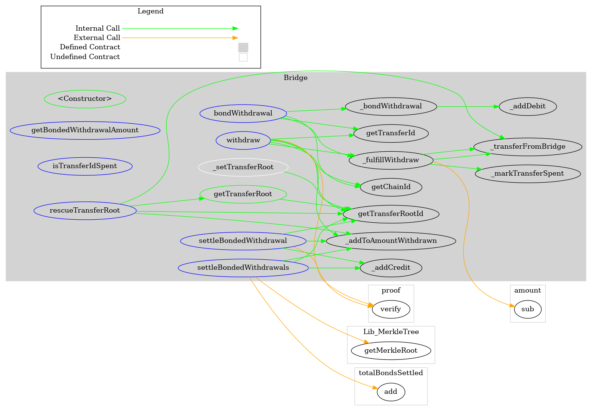
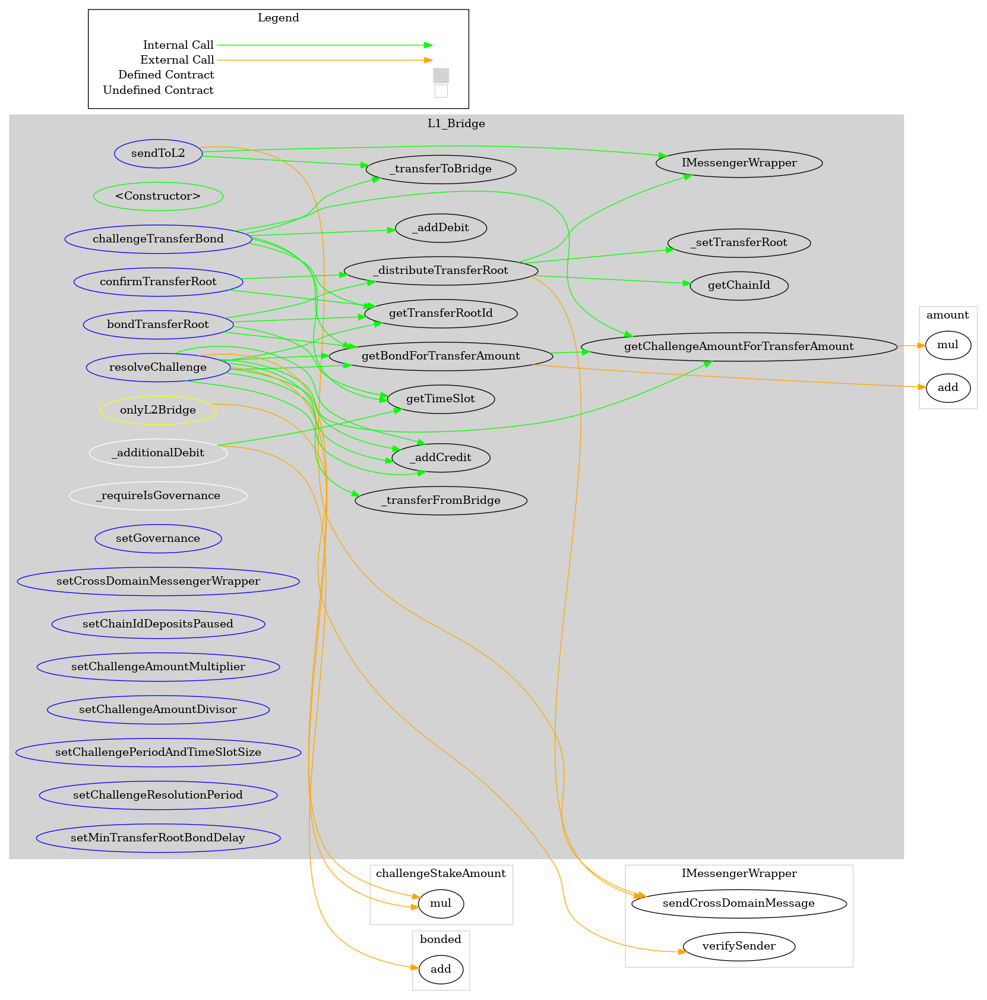
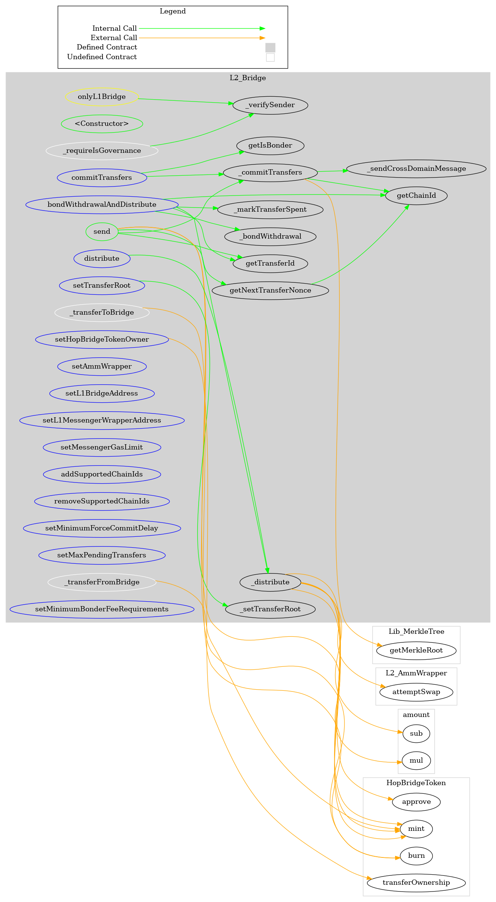

<div id="splash">
    <div id="project">
          <span class="splash-title">
               Project
          </span>
          <br />
          <span id="project-value">
               Hop Exchange Smart Contracts
          </span>
    </div>
     <div id="details">
          <div id="left">
               <span class="splash-title">
                    Client
               </span>
               <br />
               <span class="details-value">
                    Hop Protocol
               </span>
               <br />
               <span class="splash-title">
                    Date
               </span>
               <br />
               <span class="details-value">
                    April 2021
               </span>
          </div>
          <div id="right">
               <span class="splash-title">
                    Reviewers
               </span>
               <br />
               <span class="details-value">
                    Daniel Luca
               </span><br />
               <span class="contact">@cleanunicorn</span>
          </div>
    </div>
</div>


## Table of Contents
 - [Details](#details)
 - [Issues Summary](#issues-summary)
 - [Executive summary](#executive-summary)
     - [Week 1](#week-1)
     - [Week 2](#week-2)
     - [Week 3](#week-3)
 - [Scope](#scope)
 - [Recommendations](#recommendations)
     - [Improve tests](#improve-tests)
     - [Set up Continuous Integration](#set-up-continuous-integration)
 - [Issues](#issues)
     - [L2_Bridge._distribute might mint tokens for the Layer 1 Bridge and they&#x27;ll be locked](#l2_bridge_distribute-might-mint-tokens-for-the-layer-1-bridge-and-theyll-be-locked)
     - [Consider emitting events when updating the L2_Bridge config](#consider-emitting-events-when-updating-the-l2_bridge-config)
     - [Make L2_Bridge.send external](#make-l2_bridgesend-external)
     - [L2_Bridge.setMinimumBonderFeeRequirements should check minBonderBps for validity](#l2_bridgesetminimumbonderfeerequirements-should-check-minbonderbps-for-validity)
     - [Improve gas usage in L2_AmmWrapper](#improve-gas-usage-in-l2_ammwrapper)
     - [Events exist but they&#x27;re not emitted in Accounting](#events-exist-but-theyre-not-emitted-in-accounting)
     - [Optimize _ceilLog2 by using uint256](#optimize-_ceillog2-by-using-uint256)
     - [Emit events when adding and removing bonders](#emit-events-when-adding-and-removing-bonders)
     - [The method getChainId can be restricted to pure in Solidity &lt;0.8.x](#the-method-getchainid-can-be-restricted-to-pure-in-solidity-08x)
     - [Some error messages in L2_AmmWrapper refer to L2_Bridge](#some-error-messages-in-l2_ammwrapper-refer-to-l2_bridge)
     - [Update comments to be more swapper agnostic](#update-comments-to-be-more-swapper-agnostic)
 - [Artifacts](#artifacts)
     - [Surya](#surya)
 - [License](#license)


## Details

- **Client** Hop Protocol
- **Date** April 2021
- **Lead reviewer** Daniel Luca ([@cleanunicorn](https://twitter.com/cleanunicorn))
- **Reviewers** Daniel Luca ([@cleanunicorn](https://twitter.com/cleanunicorn))
- **Repository**: [Hop Exchange Smart Contracts](https://github.com/hop-protocol/contracts.git)
- **Commit hash** `f486cc2f1f5086f1fd7a3bba8645bc2b0fd700c2`
- **Technologies**
  - Solidity
  - Node.JS

## Issues Summary

| SEVERITY       |    OPEN    |    CLOSED    |
|----------------|:----------:|:------------:|
|  Informational  |  0  |  3  |
|  Minor  |  0  |  7  |
|  Medium  |  0  |  1  |
|  Major  |  0  |  0  |

## Executive summary

This report represents the results of the engagement with **Hop Protocol** to review **Hop Exchange Smart Contracts**.

The review was conducted over the course of **2.5 weeks** from **March 29 to April 14, 2021**. A total of **13 person-days** were spent reviewing the code.

### Week 1

During the first week, we started by viewing the kick-off call and getting more familiar with the architecture and the overall setup.

On the second day of the audit, we updated the commit hash to include a Merkle tree update. The `MerkleUtils` library was swapped out with the one Optimism is using. The scope was increased to include a few other contracts that are part of the system and extend the original scope included contracts.

During the 3rd day, after getting more familiar with the code and the overall architecture, we proceeded to read the whitepaper and the rest of the documentation. Our goal was to understand all the key terms and components to make sure the definitions are completely understood in the context of the system.

At the end of the week, we had another meeting with the development team to go together through a few scenarios. The important scenarios were related to entry points and data flow when a user crosses one of the bridges, i.e., user crossing L1 -> L2, user crossing L2a -> L2b (different layer 2 chains).

### Week 2

During the second week we set a daily meeting with the development team up until the end of the review to discuss new findings and ask any outstanding questions.

On Monday we identified a few small issues related to the Automated Market Maker Wrapper (AmmWrapper) and add a few questions for the development team. We proceeded to ask these questions in our daily sync. Some of the raised issues were already identified by the development team and fixed in their internal audit.

On Tuesday the development team shared with us an updated document with a few scenarios and their entry points that we should review.

[Text version of shared interaction doc](https://gist.github.com/shanefontaine/e7683e3f417a05d800661342f7d91d32/26db9f0cb661e8bb9f3427480d9bbefec1705438)

Rendered version of the interaction below:



On Wednesday we continued to draft issues based on the feedback received and continued to do the manual review.

At the end of the week we agreed to add another 3 person days in order to fully cover the review.

### Week 3

We continued the review, mostly focusing on the challenge, confirmation and root id confirmation.

At the end of the review period we finalized the report and presented it to the development team.

## Scope

The initial review focused on the [Hop Exchange Smart Contracts](https://github.com/hop-protocol/contracts.git) identified by the commit hash `f486cc2f1f5086f1fd7a3bba8645bc2b0fd700c2`.

We focused on manually reviewing the codebase, searching for security issues such as, but not limited to re-entrancy problems, transaction ordering, block timestamp dependency, exception handling, call stack depth limitation, integer overflow/underflow, self-destructible contracts, unsecured balance, use of origin, gas costly patterns, architectural problems, code readability.

**Includes:**

- ./bridges/Accounting.sol
- ./bridges/Bridge.sol
- ./bridges/L1_Bridge.sol
- ./bridges/L1_ETH_Bridge.sol
- ./bridges/L1_ERC20_Bridge.sol
- ./bridges/L2_Bridge.sol
- ./bridges/L2_AmmWrapper.sol
- ./wrappers/ArbitrumMessengerWrapper.sol
- ./wrappers/MessengerWrapper.sol
- ./wrappers/OptimismMessengerWrapper.sol
- ./wrappers/XDaiMessengerWrapper.sol

**Excludes:**

All other contracts

[Kickoff Call]: https://us02web.zoom.us/rec/share/bNizG-qf8coRzKTh4hX_M9Avo38ysBr8RU-XhVehgdDTNWfDMS3TXIO6fy8DWuQu.QZ3RuBLnq9KXHbED?startTime=1616772767000

## Recommendations

We identified a few possible general improvements that are not security issues during the review, which will bring value to the developers and the community reviewing and using the product.

### Improve tests

Currently the tests do not pass. This is because the optimism compiler npm package was changed since the code was frozen, up until the tests were run on our end. This isn't a problem with the code itself, but pinning the npm packages to a fixed version will prevent similar situations.

A sample `.env.example` config file should also be provided to anyone that wants to run the tests.

Improve the testing process to make sure all functionality is first tested and then implemented, basically writing the tests first and the implementation after. This way ensures each line of code is tested and no line of code is superfluous.

### Set up Continuous Integration

Use one of the platforms that offer Continuous Integration services and implement a list of actions that compile, test, run coverage and create alerts when the pipeline fails.

Because the repository is hosted on GitHub, the most painless way to set up the Continuous Integration is through [GitHub Actions](https://docs.github.com/en/free-pro-team@latest/actions).

Setting up the workflow can start based on this example template.

```yml
name: Continuous Integration

on:
  push:
    branches: [master]
  pull_request:
    branches: [master]

jobs:
  build:
    name: Build and test
    runs-on: ubuntu-latest
    strategy:
      matrix:
        node-version: [12.x]
    steps:
    - uses: actions/checkout@v2
    - name: Use Node.js $
      uses: actions/setup-node@v1
      with:
        node-version: $
    - run: npm ci
    - run: cp ./config.sample.js ./config.js
    - run: npm test

  coverage:
    name: Coverage
    needs: build
    runs-on: ubuntu-latest
    strategy:
      matrix:
        node-version: [12.x]
    steps:
    - uses: actions/checkout@v2
    - name: Use Node.js $
      uses: actions/setup-node@v1
      with:
        node-version: $
    - run: npm ci
    - run: cp ./config.sample.js ./config.js
    - run: npm run coverage
    - uses: actions/upload-artifact@v2
      with:
        name: Coverage $
        path: |
          coverage/
```

This CI template activates on pushes and pull requests on the **master** branch.

```yml
on:
  push:
    branches: [master]
  pull_request:
    branches: [master]
```

It uses an [Ubuntu Docker](https://hub.docker.com/_/ubuntu) image as a base for setting up the project.

```yml
    runs-on: ubuntu-latest
```

Multiple Node.js versions can be used to check integration. However, because this is not primarily a Node.js project, multiple versions don't provide added value.

```yml
    strategy:
      matrix:
        node-version: [12.x]
```

A script item should be added in the `scripts` section of [package.json](./code/package.json) that runs all tests.

```json
{
   "script": {
      "test": "buidler test"
   }
}
```

This can then be called by running `npm test` after setting up the dependencies with `npm ci`. 

If any hidden variables need to be defined, you can set them up in a local version of `./config.sample.js` (locally named `./config.js`). If you decide to do that, you should also add `./config.js` in `.gitignore` to make sure no hidden variables are pushed to the public repository. The sample config file `./config.sample.js` should be sufficient to pass the test suite.

```yml
    steps:
    - uses: actions/checkout@v2
    - name: Use Node.js $
      uses: actions/setup-node@v1
      with:
        node-version: $
    - run: npm ci
    - run: cp ./config.sample.js ./config.js
    - run: npm test
```

You can also choose to run coverage and upload the generated artifacts. 

```yml
    - run: npm run coverage
    - uses: actions/upload-artifact@v2
      with:
        name: Coverage $
        path: |
          coverage/
```

At the moment, checking the artifacts is not [that](https://github.community/t/browsing-artifacts/16954) [easy](https://github.community/t/need-clarification-on-github-actions/16027/2), because one needs to download the zip archive, unpack it and check it. However, the coverage can be checked in the [Actions](https://github.com/indexed-finance/indexed-core/actions) section once it's set up.

## Issues


### [`L2_Bridge._distribute` might mint tokens for the Layer 1 Bridge and they&#x27;ll be locked](https://github.com/monoceros-alpha/review-hopprotocol-contracts-2021-04/issues/9)
 

**Description**

The method `distribute` can only be called by the Layer 1 Bridge.


[code/contracts/bridges/L2_Bridge.sol#L176-L184](https://github.com/monoceros-alpha/review-hopprotocol-contracts-2021-04/blob/c5a6d5eead68465168373c39891ff1c5f197567a/code/contracts/bridges/L2_Bridge.sol#L176-L184)
```solidity
    function distribute(
        address recipient,
        uint256 amount,
        uint256 amountOutMin,
        uint256 deadline,
        uint256 relayerFee
    )
        external
        onlyL1Bridge
```

The `external` method calls the `internal` method `_distribute` in order to distribute tokens.


[code/contracts/bridges/L2_Bridge.sol#L263](https://github.com/monoceros-alpha/review-hopprotocol-contracts-2021-04/blob/c5a6d5eead68465168373c39891ff1c5f197567a/code/contracts/bridges/L2_Bridge.sol#L263)
```solidity
    function _distribute(address recipient, uint256 amount, uint256 amountOutMin, uint256 deadline, uint256 fee) internal {
```

If the `fee` is positive, it will mint some tokens for the caller.


[code/contracts/bridges/L2_Bridge.sol#L264-L266](https://github.com/monoceros-alpha/review-hopprotocol-contracts-2021-04/blob/c5a6d5eead68465168373c39891ff1c5f197567a/code/contracts/bridges/L2_Bridge.sol#L264-L266)
```solidity
        if (fee > 0) {
            hToken.mint(msg.sender, fee);
        }
```

In this case, the caller is the Layer 1 Bridge as stated above.

However, the L1 Bridge doesn't seem to have a method to move the tokens.

```
 +  L1_Bridge (Bridge)
    - [Pub] <Constructor> #
       - modifiers: Bridge
    - [Ext] sendToL2 ($)
    - [Ext] bondTransferRoot #
       - modifiers: onlyBonder,requirePositiveBalance
    - [Ext] confirmTransferRoot #
       - modifiers: onlyL2Bridge
    - [Int] _distributeTransferRoot #
    - [Ext] challengeTransferBond ($)
    - [Ext] resolveChallenge #
    - [Int] _additionalDebit
    - [Int] _requireIsGovernance #
    - [Ext] setGovernance #
       - modifiers: onlyGovernance
    - [Ext] setCrossDomainMessengerWrapper #
       - modifiers: onlyGovernance
    - [Ext] setChainIdDepositsPaused #
       - modifiers: onlyGovernance
    - [Ext] setChallengeAmountMultiplier #
       - modifiers: onlyGovernance
    - [Ext] setChallengeAmountDivisor #
       - modifiers: onlyGovernance
    - [Ext] setChallengePeriodAndTimeSlotSize #
       - modifiers: onlyGovernance
    - [Ext] setChallengeResolutionPeriod #
       - modifiers: onlyGovernance
    - [Ext] setMinTransferRootBondDelay #
       - modifiers: onlyGovernance
    - [Pub] getBondForTransferAmount
    - [Pub] getChallengeAmountForTransferAmount
    - [Pub] getTimeSlot
```

In which case the tokens that represent the fee, will remain locked in the Layer 1 Bridge contract.

**Recommendation**

Consider adding an additional argument to point to the receiver of the fee and pass that along through the internal `_distribute` method. This is especially useful for the `bondWithdrawalAndDistribute` method.

The fee doesn't seem necessary if the Layer 1 Bridge calls the external `distribute` method because the amount is not bonded.

---


### [Consider emitting events when updating the L2_Bridge config](https://github.com/monoceros-alpha/review-hopprotocol-contracts-2021-04/issues/17)
 

**Description**

All of these methods update important configurations for the bridge.


[code/contracts/bridges/L2_Bridge.sol#L292-L337](https://github.com/monoceros-alpha/review-hopprotocol-contracts-2021-04/blob/master/code/contracts/bridges/L2_Bridge.sol#L292-L337)
```solidity
    /* ========== External Config Management Functions ========== */

    function setAmmWrapper(L2_AmmWrapper _ammWrapper) external onlyGovernance {
        ammWrapper = _ammWrapper;
    }

    function setL1BridgeAddress(address _l1BridgeAddress) external onlyGovernance {
        l1BridgeAddress = _l1BridgeAddress;
    }

    function setL1MessengerWrapperAddress(address _l1MessengerWrapperAddress) external onlyGovernance {
        l1MessengerWrapperAddress = _l1MessengerWrapperAddress;
    }

    function setMessengerGasLimit(uint256 _messengerGasLimit) external onlyGovernance {
        messengerGasLimit = _messengerGasLimit;
    }

    function addSupportedChainIds(uint256[] calldata chainIds) external onlyGovernance {
        for (uint256 i = 0; i < chainIds.length; i++) {
            supportedChainIds[chainIds[i]] = true;
        }
    }

    function removeSupportedChainIds(uint256[] calldata chainIds) external onlyGovernance {
        for (uint256 i = 0; i < chainIds.length; i++) {
            supportedChainIds[chainIds[i]] = false;
        }
    }

    function setMinimumForceCommitDelay(uint256 _minimumForceCommitDelay) external onlyGovernance {
        minimumForceCommitDelay = _minimumForceCommitDelay;
    }

    function setMaxPendingTransfers(uint256 _maxPendingTransfers) external onlyGovernance {
        maxPendingTransfers = _maxPendingTransfers;
    }

    function setHopBridgeTokenOwner(address newOwner) external onlyGovernance {
        hToken.transferOwnership(newOwner);
    }

    function setMinimumBonderFeeRequirements(uint256 _minBonderBps, uint256 _minBonderFeeAbsolute) external onlyGovernance {
        minBonderBps = _minBonderBps;
        minBonderFeeAbsolute = _minBonderFeeAbsolute;
    }
```

**Recommendation**

Consider emitting events with the new values (and possibly old values) when these changes go through.

Similarly can be done for `L1_Bridge`.

---


### [Make `L2_Bridge.send` external](https://github.com/monoceros-alpha/review-hopprotocol-contracts-2021-04/issues/16)
 

**Description**

The method is only called externally. To signal it will not be called internally by the contract or by another implementation that extends the `L2_Bridge` it could be defined as `external`.

**Recommendation**

Consider defining the method as `external` if it's not called internally.


---


### [`L2_Bridge.setMinimumBonderFeeRequirements` should check `minBonderBps` for validity](https://github.com/monoceros-alpha/review-hopprotocol-contracts-2021-04/issues/13)
 

**Description**

The governance can set a minimum fee, as well as a minimum percentage by calling `setMinimumBonderFeeRequirements`.


[code/contracts/bridges/L2_Bridge.sol#L334-L337](https://github.com/monoceros-alpha/review-hopprotocol-contracts-2021-04/blob/c5a6d5eead68465168373c39891ff1c5f197567a/code/contracts/bridges/L2_Bridge.sol#L334-L337)
```solidity
    function setMinimumBonderFeeRequirements(uint256 _minBonderBps, uint256 _minBonderFeeAbsolute) external onlyGovernance {
        minBonderBps = _minBonderBps;
        minBonderFeeAbsolute = _minBonderFeeAbsolute;
    }
```

The values could be checked for sanity, especially the percentage.

**Recommendation**

Check the value of `minBonderBps` to be something less than `10000`.


---


### [Improve gas usage in `L2_AmmWrapper`](https://github.com/monoceros-alpha/review-hopprotocol-contracts-2021-04/issues/11)
 

**Description**

The contract `L2_AmmWrapper` has a few storage variables.


[code/contracts/bridges/L2_AmmWrapper.sol#L13-L17](https://github.com/monoceros-alpha/review-hopprotocol-contracts-2021-04/blob/c5a6d5eead68465168373c39891ff1c5f197567a/code/contracts/bridges/L2_AmmWrapper.sol#L13-L17)
```solidity
    L2_Bridge public bridge;
    IERC20 public l2CanonicalToken;
    bool public l2CanonicalTokenIsEth;
    IERC20 public hToken;
    Swap public exchangeAddress;
```

These storage vars are set at deploy time.


[code/contracts/bridges/L2_AmmWrapper.sol#L19-L34](https://github.com/monoceros-alpha/review-hopprotocol-contracts-2021-04/blob/c5a6d5eead68465168373c39891ff1c5f197567a/code/contracts/bridges/L2_AmmWrapper.sol#L19-L34)
```solidity
    /// @notice When l2CanonicalTokenIsEth is true, l2CanonicalToken should be set to the WETH address
    constructor(
        L2_Bridge _bridge,
        IERC20 _l2CanonicalToken,
        bool _l2CanonicalTokenIsEth,
        IERC20 _hToken,
        Swap _exchangeAddress
    )
        public
    {
        bridge = _bridge;
        l2CanonicalToken = _l2CanonicalToken;
        l2CanonicalTokenIsEth = _l2CanonicalTokenIsEth;
        hToken = _hToken;
        exchangeAddress = _exchangeAddress;
    }
```

None of them are changed after the initial set.

This is why they could be defined as `immutable`. Solidity does not reserve a storage slot for immutables, but every occurrence is replaced in the bytecode by the respective value. This greatly reduces gas costs.

To have a better understanding of the gas cost reduction, two contracts were created.

The first contract defines a storage variable and sets it at deploy time. It also set the variable to `public`, this way Solidity will create a getter for it. This getter is important to measure the gas cost to access it.

```solidity
contract A {
    bool public isSet;
    
    constructor(bool _isSet) public {
        isSet = _isSet;
    }
}
```

The second contract uses an `immutable` instead of a storage slot. That is the only difference between the two.

```solidity
contract B {
    bool public immutable isSet;
    
    constructor(bool _isSet) public {
        isSet = _isSet;
    }
}
```

We've created the following table to show the differences in gas costs between the two approaches.

|              | deploy gas cost | getter gas cost |
| ------------ | --------------- | --------------- |
| storage slot | 47801           | 988             |
| immutable    | 32403           | 182             |

Both examples were tested in Remix IDE, Solidity version 0.6.12, optimization runs 200.

**Recommendation**

Change all state variables to `immutable` to greatly reduce gas costs.

Similarly, change the state variables to `immutable` in `L2_Bridge`.


[code/contracts/bridges/L2_Bridge.sol#L78-L80](https://github.com/monoceros-alpha/review-hopprotocol-contracts-2021-04/blob/24ccdb4d4528ecb4e92c3d7ac5e1909bf8de34f7/code/contracts/bridges/L2_Bridge.sol#L78-L80)
```solidity
        l1Governance = _l1Governance;
        hToken = _hToken;
        l2CanonicalToken = _l2CanonicalToken;
```

But also in these cases (not a complete list):


[code/contracts/wrappers/ArbitrumMessengerWrapper.sol#L36-L39](https://github.com/monoceros-alpha/review-hopprotocol-contracts-2021-04/blob/24ccdb4d4528ecb4e92c3d7ac5e1909bf8de34f7/code/contracts/wrappers/ArbitrumMessengerWrapper.sol#L36-L39)
```solidity
        arbInbox = _arbInbox;
        arbBridge = arbInbox.bridge();
        defaultGasPrice = _defaultGasPrice;
        defaultCallValue = _defaultCallValue;
```


[code/contracts/wrappers/OptimismMessengerWrapper.sol#L29](https://github.com/monoceros-alpha/review-hopprotocol-contracts-2021-04/blob/24ccdb4d4528ecb4e92c3d7ac5e1909bf8de34f7/code/contracts/wrappers/OptimismMessengerWrapper.sol#L29)
```solidity
        l1MessengerAddress = _l1MessengerAddress;
```


[code/contracts/wrappers/XDaiMessengerWrapper.sol#L35-L36](https://github.com/monoceros-alpha/review-hopprotocol-contracts-2021-04/blob/24ccdb4d4528ecb4e92c3d7ac5e1909bf8de34f7/code/contracts/wrappers/XDaiMessengerWrapper.sol#L35-L36)
```solidity
        l2ChainId = bytes32(_l2ChainId);
        ambBridge = _ambBridge;
```

There are instances where some state variables are never changed in other contracts. If you think you won't change them in the future, consider checking all contract constructors.

**References**

- [Constant and Immutable State Variables](https://docs.soliditylang.org/en/v0.6.12/contracts.html#constant-and-immutable-state-variables)

---


### [Events exist but they&#x27;re not emitted in `Accounting`](https://github.com/monoceros-alpha/review-hopprotocol-contracts-2021-04/issues/4)
 

**Description**

The Accounting contract takes care of low-level accounting and has a couple of `external` methods that handle staking and unstaking of funds.


[code/contracts/bridges/Accounting.sol#L118-L127](https://github.com/monoceros-alpha/review-hopprotocol-contracts-2021-04/blob/8e53a77cafe91a8ad6a09a99ee387b8566cd726b/code/contracts/bridges/Accounting.sol#L118-L127)
```solidity
    /** 
     * @dev Allows the bonder to deposit tokens and increase its credit balance
     * @param bonder The address being staked on
     * @param amount The amount being staked
     */
    function stake(address bonder, uint256 amount) external payable {
        require(_isBonder[bonder] == true, "ACT: Address is not bonder");
        _transferToBridge(msg.sender, amount);
        _addCredit(bonder, amount);
    }
```


[code/contracts/bridges/Accounting.sol#L129-L136](https://github.com/monoceros-alpha/review-hopprotocol-contracts-2021-04/blob/8e53a77cafe91a8ad6a09a99ee387b8566cd726b/code/contracts/bridges/Accounting.sol#L129-L136)
```solidity
    /**
     * @dev Allows the caller to withdraw any available balance and add to their debit balance
     * @param amount The amount being staked
     */
    function unstake(uint256 amount) external requirePositiveBalance {
        _addDebit(msg.sender, amount);
        _transferFromBridge(msg.sender, amount);
    }
```

A couple of matching events exist in the contract.


[code/contracts/bridges/Accounting.sol#L28-L30](https://github.com/monoceros-alpha/review-hopprotocol-contracts-2021-04/blob/8e53a77cafe91a8ad6a09a99ee387b8566cd726b/code/contracts/bridges/Accounting.sol#L28-L30)
```solidity
    event Stake (
        uint256 amount
    );
```


[code/contracts/bridges/Accounting.sol#L32-L34](https://github.com/monoceros-alpha/review-hopprotocol-contracts-2021-04/blob/8e53a77cafe91a8ad6a09a99ee387b8566cd726b/code/contracts/bridges/Accounting.sol#L32-L34)
```solidity
    event Unstake (
        uint256 amount
    );
```

But they are not emitted in this contract or in any contract that inherits `Accounting`.

**Recommendation**

Emit events when staking and unstaking.


---


### [Optimize `_ceilLog2` by using `uint256`](https://github.com/monoceros-alpha/review-hopprotocol-contracts-2021-04/issues/3)
 

**Description**

The method `Lib_MerkleTree._ceilLog2` is used in the `getMerkleRoot` method to calculate the total siblings count.


[code/contracts/libraries/Lib_MerkleTree.sol#L144-L147](https://github.com/monoceros-alpha/review-hopprotocol-contracts-2021-04/blob/5e66c267c52206b7e77d5515f64d939e85539f04/code/contracts/libraries/Lib_MerkleTree.sol#L144-L147)
```solidity
        require(
            _siblings.length == _ceilLog2(_totalLeaves),
            "Lib_MerkleTree: Total siblings does not correctly correspond to total leaves."
        );
```

As stated in the source code, it was copied from the Solidity examples repository.


[code/contracts/libraries/Lib_MerkleTree.sol#L202-L203](https://github.com/monoceros-alpha/review-hopprotocol-contracts-2021-04/blob/5e66c267c52206b7e77d5515f64d939e85539f04/code/contracts/libraries/Lib_MerkleTree.sol#L202-L203)
```solidity
        // Find the highest set bit (will be floor(log_2)).
        // Borrowed with <3 from https://github.com/ethereum/solidity-examples
```

The Solidity example repository includes this method as an example for other developers to learn how to use the language. Because it does not strive to be the optimal implementation, its purpose is to show different features of the language itself.


[src/bits/Bits.sol#L87-L99](https://github.com/ethereum/solidity-examples/blob/f44fe3b3b4cca94afe9c2a2d5b7840ff0fafb72e/src/bits/Bits.sol#L87-L99)
```solidity
    // Computes the index of the highest bit set in 'self'.
    // Returns the highest bit set as an 'uint8'.
    // Requires that 'self != 0'.
    function highestBitSet(uint self) internal pure returns (uint8 highest) {
        require(self != 0);
        uint val = self;
        for (uint8 i = 128; i >= 1; i >>= 1) {
            if (val & (ONE << i) - 1 << i != 0) {
                highest += i;
                val >>= i;
            }
        }
    }
```

This is why some of the examples in the Solidity repository might not be gas optimized.

Using `uint8` in the loop forces the compiler to create sub-optimal code.

The following Solidity contract example was used to measure the difference between using `uint8` and `uint256` with a few example inputs.

```solidity
contract FindBit {
    function find_highest_set_bit(
        uint value
    ) 
        public 
        pure 
        returns (
            uint
        ) 
    {
        uint _in = value;
        
        if (_in == 1) {
            return 0;
        }

        // Find the highest set bit (will be floor(log_2)).
        // Borrowed with <3 from https://github.com/ethereum/solidity-examples
        uint256 val = _in;
        uint256 highest = 0;
        for (uint8 i = 128; i >= 1; i >>= 1) {
            if (val & (uint(1) << i) - 1 << i != 0) {
                highest += i;
                val >>= i;
            }
        }

        // Increment by one if this is not a perfect logarithm.
        if ((uint(1) << highest) != _in) {
            highest += 1;
        }

        return highest;        
    }
}
```

Changing the line from `uint8` to `uint256` 

```solidity
        for (uint8 i = 128; i >= 1; i >>= 1) {
```

```solidity
        for (uint256 i = 128; i >= 1; i >>= 1) {
```

Gives the following different gas costs, while returning the same, identical results.

Solidity version 0.8.3+commit.8d00100c and 200 optimization runs were used in Remix IDE for tests.

| input                                       | output | uint8 gas | uint256 gas | difference |
| ------------------------------------------- | ------ | --------- | ----------- | ---------- |
| 8                                           | 3      | 1876      | 1692        | 184        |
| 15                                          | 4      | 1951      | 1767        | 184        |
| 100                                         | 7      | 1951      | 1767        | 184        |
| 128                                         | 7      | 1980      | 1779        | 201        |
| 4294967295 (`0xffffffff`)                   | 32     | 2263      | 2028        | 235        |
| 1099511627775 (`0xffffffffff`)              | 40     | 2159      | 1941        | 218        |
| 18446744073709552000 (`0xffffffffffffffff`) | 64     | 2367      | 2115        | 252        |


**Recommendation**

Modify the loop iterator from `uint8` to `uint256` to reduce gas costs, while having the same output.

**References**

- [Solidity example, highest set bit](https://github.com/ethereum/solidity-examples/blob/f44fe3b3b4cca94afe9c2a2d5b7840ff0fafb72e/src/bits/Bits.sol#L87-L99)
- [Optimism MerkleTree implementation](https://github.com/ethereum-optimism/contracts/blob/b3f2de7e12445bd2e420e289b537cd501035e1e1/contracts/optimistic-ethereum/libraries/utils/Lib_MerkleTree.sol#L202-L211)


---


### [Emit events when adding and removing bonders](https://github.com/monoceros-alpha/review-hopprotocol-contracts-2021-04/issues/2)
 

**Description**

The methods `addBonder` and `removeBonder` respectively add and remove bonders.


[code/contracts/bridges/Accounting.sol#L138-L145](https://github.com/monoceros-alpha/review-hopprotocol-contracts-2021-04/blob/cb9804f243005850597952f5152d7b9397f9968b/code/contracts/bridges/Accounting.sol#L138-L145)
```solidity
    /**
     * @dev Add Bonder to allowlist
     * @param bonder The address being added as a Bonder
     */
    function addBonder(address bonder) external onlyGovernance {
        require(_isBonder[bonder] == false, "ACT: Address is already bonder");
        _isBonder[bonder] = true;
    }
```


[code/contracts/bridges/Accounting.sol#L147-L154](https://github.com/monoceros-alpha/review-hopprotocol-contracts-2021-04/blob/cb9804f243005850597952f5152d7b9397f9968b/code/contracts/bridges/Accounting.sol#L147-L154)
```solidity
    /**
     * @dev Remove Bonder from allowlist
     * @param bonder The address being removed as a Bonder
     */
    function removeBonder(address bonder) external onlyGovernance {
        require(_isBonder[bonder] == true, "ACT: Address is not bonder");
        _isBonder[bonder] = false;
    }
```

Also, the constructor adds a list of bonders to the bonder list.


[code/contracts/bridges/Accounting.sol#L54-L59](https://github.com/monoceros-alpha/review-hopprotocol-contracts-2021-04/blob/cb9804f243005850597952f5152d7b9397f9968b/code/contracts/bridges/Accounting.sol#L54-L59)
```solidity
    /// @dev Sets the bonder addresses
    constructor(address[] memory bonders) public {
        for (uint256 i = 0; i < bonders.length; i++) {
            _isBonder[bonders[i]] = true;
        }
    }
```

It might be beneficial to emit events when adding and removing bonders.

**Recommendation**

Consider emitting events when adding or removing bonders.


---


### [The method `getChainId` can be restricted to `pure` in Solidity &lt;0.8.x](https://github.com/monoceros-alpha/review-hopprotocol-contracts-2021-04/issues/19)
 

**Description**

This method is set as `view` but can be restricted to `pure` as long as the Solidity version is `<0.8.x`.


[code/contracts/bridges/Bridge.sol#L112](https://github.com/monoceros-alpha/review-hopprotocol-contracts-2021-04/blob/51418c09ffde685e7f03be3308d723aa96fad13c/code/contracts/bridges/Bridge.sol#L112)
```solidity
    function getChainId() public virtual view returns (uint256 chainId) {
```

Also, the *hack* to silence the state mutability can also be removed.


[code/contracts/bridges/Bridge.sol#L113](https://github.com/monoceros-alpha/review-hopprotocol-contracts-2021-04/blob/51418c09ffde685e7f03be3308d723aa96fad13c/code/contracts/bridges/Bridge.sol#L113)
```solidity
        this; // Silence state mutability warning without generating any additional byte code
```

If you need the `view` mutability in order to allow other layer 2 implementations to first save and then retrieve the value from the contract state, keep the `view` modifier, otherwise consider switching to `pure`. Solidity does not do too many things differently but uses `STATICCALL` when calling the method to make sure the state is not changed.

**Recommendation**

Unless there's a reason to keep the `view`, consider changing to `pure`.


---


### [Some error messages in `L2_AmmWrapper` refer to `L2_Bridge`](https://github.com/monoceros-alpha/review-hopprotocol-contracts-2021-04/issues/12)
 

**Description**

There are a couple of error messages that refer to the L2 Bridge


[code/contracts/bridges/L2_AmmWrapper.sol#L50](https://github.com/monoceros-alpha/review-hopprotocol-contracts-2021-04/blob/c5a6d5eead68465168373c39891ff1c5f197567a/code/contracts/bridges/L2_AmmWrapper.sol#L50)
```solidity
        require(amount >= bonderFee, "L2_BRG: Bonder fee cannot exceed amount");
```


[code/contracts/bridges/L2_AmmWrapper.sol#L53](https://github.com/monoceros-alpha/review-hopprotocol-contracts-2021-04/blob/c5a6d5eead68465168373c39891ff1c5f197567a/code/contracts/bridges/L2_AmmWrapper.sol#L53)
```solidity
            require(msg.value == amount, "L2_BRG: Value does not match amount");
```

Typically the `L2_BRG` error prefix is found in `Bridge` and `L2_Bridge`.

Also, the other error messages seem to refer to the Uniswap Wrapper.


[code/contracts/bridges/L2_AmmWrapper.sol#L56](https://github.com/monoceros-alpha/review-hopprotocol-contracts-2021-04/blob/c5a6d5eead68465168373c39891ff1c5f197567a/code/contracts/bridges/L2_AmmWrapper.sol#L56)
```solidity
            require(l2CanonicalToken.transferFrom(msg.sender, address(this), amount), "L2_UW: TransferFrom failed");
```


[code/contracts/bridges/L2_AmmWrapper.sol#L59](https://github.com/monoceros-alpha/review-hopprotocol-contracts-2021-04/blob/c5a6d5eead68465168373c39891ff1c5f197567a/code/contracts/bridges/L2_AmmWrapper.sol#L59)
```solidity
        require(l2CanonicalToken.approve(address(exchangeAddress), amount), "L2_UW: Approve failed");
```


[code/contracts/bridges/L2_AmmWrapper.sol#L72-L73](https://github.com/monoceros-alpha/review-hopprotocol-contracts-2021-04/blob/c5a6d5eead68465168373c39891ff1c5f197567a/code/contracts/bridges/L2_AmmWrapper.sol#L72-L73)
```solidity
        require(hToken.transferFrom(msg.sender, address(this), amount), "L2_UW: TransferFrom failed");
        require(hToken.approve(address(exchangeAddress), amount), "L2_UW: Approve failed");
```


[code/contracts/bridges/L2_AmmWrapper.sol#L88](https://github.com/monoceros-alpha/review-hopprotocol-contracts-2021-04/blob/c5a6d5eead68465168373c39891ff1c5f197567a/code/contracts/bridges/L2_AmmWrapper.sol#L88)
```solidity
            require(hToken.transfer(recipient, amount), "L2_UW: Transfer failed");
```


[code/contracts/bridges/L2_AmmWrapper.sol#L95](https://github.com/monoceros-alpha/review-hopprotocol-contracts-2021-04/blob/c5a6d5eead68465168373c39891ff1c5f197567a/code/contracts/bridges/L2_AmmWrapper.sol#L95)
```solidity
            require(success, 'L2_UW: ETH transfer failed');
```


[code/contracts/bridges/L2_AmmWrapper.sol#L97](https://github.com/monoceros-alpha/review-hopprotocol-contracts-2021-04/blob/c5a6d5eead68465168373c39891ff1c5f197567a/code/contracts/bridges/L2_AmmWrapper.sol#L97)
```solidity
            require(l2CanonicalToken.transfer(recipient, amountOut), "L2_UW: Transfer failed");
```

**Recommendation**

Update the error messages to correctly reflect the current contract.


---


### [Update comments to be more swapper agnostic](https://github.com/monoceros-alpha/review-hopprotocol-contracts-2021-04/issues/7)
 

**Description**

Uniswap is mentioned, make sure to replace with something like AMM.


[code/contracts/bridges/L2_AmmWrapper.sol#L56](https://github.com/monoceros-alpha/review-hopprotocol-contracts-2021-04/blob/c5a6d5eead68465168373c39891ff1c5f197567a/code/contracts/bridges/L2_AmmWrapper.sol#L56)
```solidity
            require(l2CanonicalToken.transferFrom(msg.sender, address(this), amount), "L2_UW: TransferFrom failed");
```


[code/contracts/bridges/L2_AmmWrapper.sol#L59](https://github.com/monoceros-alpha/review-hopprotocol-contracts-2021-04/blob/c5a6d5eead68465168373c39891ff1c5f197567a/code/contracts/bridges/L2_AmmWrapper.sol#L59)
```solidity
        require(l2CanonicalToken.approve(address(exchangeAddress), amount), "L2_UW: Approve failed");
```


[code/contracts/bridges/L2_AmmWrapper.sol#L72-L73](https://github.com/monoceros-alpha/review-hopprotocol-contracts-2021-04/blob/c5a6d5eead68465168373c39891ff1c5f197567a/code/contracts/bridges/L2_AmmWrapper.sol#L72-L73)
```solidity
        require(hToken.transferFrom(msg.sender, address(this), amount), "L2_UW: TransferFrom failed");
        require(hToken.approve(address(exchangeAddress), amount), "L2_UW: Approve failed");
```


[code/contracts/bridges/L2_AmmWrapper.sol#L88](https://github.com/monoceros-alpha/review-hopprotocol-contracts-2021-04/blob/c5a6d5eead68465168373c39891ff1c5f197567a/code/contracts/bridges/L2_AmmWrapper.sol#L88)
```solidity
            require(hToken.transfer(recipient, amount), "L2_UW: Transfer failed");
```


[code/contracts/bridges/L2_AmmWrapper.sol#L95](https://github.com/monoceros-alpha/review-hopprotocol-contracts-2021-04/blob/c5a6d5eead68465168373c39891ff1c5f197567a/code/contracts/bridges/L2_AmmWrapper.sol#L95)
```solidity
            require(success, 'L2_UW: ETH transfer failed');
```


[code/contracts/bridges/L2_AmmWrapper.sol#L97](https://github.com/monoceros-alpha/review-hopprotocol-contracts-2021-04/blob/c5a6d5eead68465168373c39891ff1c5f197567a/code/contracts/bridges/L2_AmmWrapper.sol#L97)
```solidity
            require(l2CanonicalToken.transfer(recipient, amountOut), "L2_UW: Transfer failed");
```

**Recommendation**

Make sure to update the error messages to reflect the current contract.


---


## Artifacts

### Surya

Sūrya is a utility tool for smart contract systems. It provides a number of visual outputs and information about the structure of smart contracts. It also supports querying the function call graph in multiple ways to aid in the manual inspection and control flow analysis of contracts.

<!-- **Contracts Description Table**

```text
surya mdreport report.md Contract.sol
```

-->

#### Graphs

##### Inheritance

Display of the full inheritance path.



##### Full graph of interaction

Some of the interactions are not visible in this graph because they are sent over the bridge by abi encoding and seding them over the messenger.



##### Bridges graph


##### Bridge graph



##### L1_Bridge



##### L2_Bridge



<!-- ***Contract***

```text
surya graph Contract.sol | dot -Tpng > ./static/Contract_graph.png
```


```text
surya inheritance Contract.sol | dot -Tpng > ./static/Contract_inheritance.png
```


```text
Use Solidity Visual Auditor
```

 -->

#### Describe

##### Files Description Table


| File Name                                 | SHA-1 Hash                               |
| ----------------------------------------- | ---------------------------------------- |
| ./contracts/bridges/Accounting.sol        | dd830703b1d1fa5ed53b50d807ef19657d36e168 |
| ./contracts/bridges/Bridge.sol            | 7a5a673d36e65640d01a3b9057cd878ed8d76613 |
| ./contracts/bridges/HopBridgeToken.sol    | a006bd5671b05bce010e0583ff7371a55beb4406 |
| ./contracts/bridges/L1_Bridge.sol         | a96db5f564635ad532909560480bc079ae1d9b7d |
| ./contracts/bridges/L1_ERC20_Bridge.sol   | d24c55c6668d4d280290f2580a8c16cb3b3d9f4f |
| ./contracts/bridges/L1_ETH_Bridge.sol     | 242b48dad540ad06320e545905d7aa7c7abe81c4 |
| ./contracts/bridges/L2_AmmWrapper.sol     | 53286765e1cd505c2055cc357862f9225ab09257 |
| ./contracts/bridges/L2_ArbitrumBridge.sol | 146eb9cc5903c55133e63d72b80200be49401e93 |
| ./contracts/bridges/L2_Bridge.sol         | 3840324c973bd5a0b338f9e85b8f115f64a9fc60 |
| ./contracts/bridges/L2_OptimismBridge.sol | 945ae3984a17b087889de7245688825bce5b6df2 |
| ./contracts/bridges/L2_UniswapWrapper.sol | 67a4f013266ff156636184124bc20b8db3a35dec |
| ./contracts/bridges/L2_XDaiBridge.sol     | 56d4e2b02bbb7b4d76dd31c1a47642fc5ab1ee54 |


##### Contracts Description Table


|       Contract        |                Type                 |     Bases      |                |                                   |
| :-------------------: | :---------------------------------: | :------------: | :------------: | :-------------------------------: |
|           └           |          **Function Name**          | **Visibility** | **Mutability** |           **Modifiers**           |
|                       |                                     |                |                |                                   |
|    **Accounting**     |           Implementation            |                |                |                                   |
|           └           |            <Constructor>            |    Public ❗️    |       🛑        |                NO❗️                |
|           └           |         _transferFromBridge         |   Internal 🔒   |       🛑        |                                   |
|           └           |          _transferToBridge          |   Internal 🔒   |       🛑        |                                   |
|           └           |        _requireIsGovernance         |   Internal 🔒   |       🛑        |                                   |
|           └           |          _additionalDebit           |   Internal 🔒   |                |                                   |
|           └           |             getIsBonder             |    Public ❗️    |                |                NO❗️                |
|           └           |              getCredit              |    Public ❗️    |                |                NO❗️                |
|           └           |             getRawDebit             |   External ❗️   |                |                NO❗️                |
|           └           |     getDebitAndAdditionalDebit      |    Public ❗️    |                |                NO❗️                |
|           └           |                stake                |   External ❗️   |       💵        |                NO❗️                |
|           └           |               unstake               |   External ❗️   |       🛑        |      requirePositiveBalance       |
|           └           |              addBonder              |   External ❗️   |       🛑        |          onlyGovernance           |
|           └           |            removeBonder             |   External ❗️   |       🛑        |          onlyGovernance           |
|           └           |             _addCredit              |   Internal 🔒   |       🛑        |                                   |
|           └           |              _addDebit              |   Internal 🔒   |       🛑        |                                   |
|                       |                                     |                |                |                                   |
|      **Bridge**       |           Implementation            |   Accounting   |                |                                   |
|           └           |            <Constructor>            |    Public ❗️    |       🛑        |            Accounting             |
|           └           |            getTransferId            |    Public ❗️    |                |                NO❗️                |
|           └           |             getChainId              |    Public ❗️    |                |                NO❗️                |
|           └           |          getTransferRootId          |    Public ❗️    |                |                NO❗️                |
|           └           |           getTransferRoot           |    Public ❗️    |                |                NO❗️                |
|           └           |      getBondedWithdrawalAmount      |   External ❗️   |                |                NO❗️                |
|           └           |          isTransferIdSpent          |   External ❗️   |                |                NO❗️                |
|           └           |              withdraw               |   External ❗️   |       🛑        |                NO❗️                |
|           └           |           bondWithdrawal            |   External ❗️   |       🛑        | onlyBonder requirePositiveBalance |
|           └           |       settleBondedWithdrawal        |   External ❗️   |       🛑        |                NO❗️                |
|           └           |       settleBondedWithdrawals       |   External ❗️   |       🛑        |                NO❗️                |
|           └           |         rescueTransferRoot          |   External ❗️   |       🛑        |          onlyGovernance           |
|           └           |         _markTransferSpent          |   Internal 🔒   |       🛑        |                                   |
|           └           |        _addToAmountWithdrawn        |   Internal 🔒   |       🛑        |                                   |
|           └           |          _setTransferRoot           |   Internal 🔒   |       🛑        |                                   |
|           └           |           _bondWithdrawal           |   Internal 🔒   |       🛑        |                                   |
|           └           |          _fulfillWithdraw           |   Private 🔐    |       🛑        |                                   |
|                       |                                     |                |                |                                   |
|  **HopBridgeToken**   |           Implementation            | ERC20, Ownable |                |                                   |
|           └           |            <Constructor>            |    Public ❗️    |       🛑        |               ERC20               |
|           └           |                mint                 |   External ❗️   |       🛑        |             onlyOwner             |
|           └           |                burn                 |   External ❗️   |       🛑        |             onlyOwner             |
|                       |                                     |                |                |                                   |
|     **L1_Bridge**     |           Implementation            |     Bridge     |                |                                   |
|           └           |            <Constructor>            |    Public ❗️    |       🛑        |              Bridge               |
|           └           |              sendToL2               |   External ❗️   |       💵        |                NO❗️                |
|           └           |          bondTransferRoot           |   External ❗️   |       🛑        | onlyBonder requirePositiveBalance |
|           └           |         confirmTransferRoot         |   External ❗️   |       🛑        |           onlyL2Bridge            |
|           └           |       _distributeTransferRoot       |   Internal 🔒   |       🛑        |                                   |
|           └           |        challengeTransferBond        |   External ❗️   |       💵        |                NO❗️                |
|           └           |          resolveChallenge           |   External ❗️   |       🛑        |                NO❗️                |
|           └           |          _additionalDebit           |   Internal 🔒   |                |                                   |
|           └           |        _requireIsGovernance         |   Internal 🔒   |       🛑        |                                   |
|           └           |            setGovernance            |   External ❗️   |       🛑        |          onlyGovernance           |
|           └           |   setCrossDomainMessengerWrapper    |   External ❗️   |       🛑        |          onlyGovernance           |
|           └           |      setChainIdDepositsPaused       |   External ❗️   |       🛑        |          onlyGovernance           |
|           └           |    setChallengeAmountMultiplier     |   External ❗️   |       🛑        |          onlyGovernance           |
|           └           |      setChallengeAmountDivisor      |   External ❗️   |       🛑        |          onlyGovernance           |
|           └           |  setChallengePeriodAndTimeSlotSize  |   External ❗️   |       🛑        |          onlyGovernance           |
|           └           |    setChallengeResolutionPeriod     |   External ❗️   |       🛑        |          onlyGovernance           |
|           └           |     setMinTransferRootBondDelay     |   External ❗️   |       🛑        |          onlyGovernance           |
|           └           |      getBondForTransferAmount       |    Public ❗️    |                |                NO❗️                |
|           └           | getChallengeAmountForTransferAmount |    Public ❗️    |                |                NO❗️                |
|           └           |             getTimeSlot             |    Public ❗️    |                |                NO❗️                |
|                       |                                     |                |                |                                   |
|  **L1_ERC20_Bridge**  |           Implementation            |   L1_Bridge    |                |                                   |
|           └           |            <Constructor>            |    Public ❗️    |       🛑        |             L1_Bridge             |
|           └           |         _transferFromBridge         |   Internal 🔒   |       🛑        |                                   |
|           └           |          _transferToBridge          |   Internal 🔒   |       🛑        |                                   |
|                       |                                     |                |                |                                   |
|   **L1_ETH_Bridge**   |           Implementation            |   L1_Bridge    |                |                                   |
|           └           |            <Constructor>            |    Public ❗️    |       🛑        |             L1_Bridge             |
|           └           |         _transferFromBridge         |   Internal 🔒   |       🛑        |                                   |
|           └           |          _transferToBridge          |   Internal 🔒   |       🛑        |                                   |
|                       |                                     |                |                |                                   |
|   **L2_AmmWrapper**   |           Implementation            |                |                |                                   |
|           └           |            <Constructor>            |    Public ❗️    |       🛑        |                NO❗️                |
|           └           |             swapAndSend             |    Public ❗️    |       💵        |                NO❗️                |
|           └           |             attemptSwap             |   External ❗️   |       🛑        |                NO❗️                |
|                       |                                     |                |                |                                   |
| **L2_ArbitrumBridge** |           Implementation            |   L2_Bridge    |                |                                   |
|           └           |            <Constructor>            |    Public ❗️    |       🛑        |             L2_Bridge             |
|           └           |       _sendCrossDomainMessage       |   Internal 🔒   |       🛑        |                                   |
|           └           |            _verifySender            |   Internal 🔒   |       🛑        |                                   |
|           └           |            setMessenger             |   External ❗️   |       🛑        |           onlyL1Bridge            |
|                       |                                     |                |                |                                   |
|     **L2_Bridge**     |           Implementation            |     Bridge     |                |                                   |
|           └           |            <Constructor>            |    Public ❗️    |       🛑        |              Bridge               |
|           └           |       _sendCrossDomainMessage       |   Internal 🔒   |       🛑        |                                   |
|           └           |            _verifySender            |   Internal 🔒   |       🛑        |                                   |
|           └           |                send                 |    Public ❗️    |       🛑        |                NO❗️                |
|           └           |           commitTransfers           |   External ❗️   |       🛑        |                NO❗️                |
|           └           |             distribute              |   External ❗️   |       🛑        |           onlyL1Bridge            |
|           └           |     bondWithdrawalAndDistribute     |   External ❗️   |       🛑        | onlyBonder requirePositiveBalance |
|           └           |           setTransferRoot           |   External ❗️   |       🛑        |           onlyL1Bridge            |
|           └           |          _commitTransfers           |   Internal 🔒   |       🛑        |                                   |
|           └           |             _distribute             |   Internal 🔒   |       🛑        |                                   |
|           └           |         _transferFromBridge         |   Internal 🔒   |       🛑        |                                   |
|           └           |          _transferToBridge          |   Internal 🔒   |       🛑        |                                   |
|           └           |        _requireIsGovernance         |   Internal 🔒   |       🛑        |                                   |
|           └           |            setAmmWrapper            |   External ❗️   |       🛑        |          onlyGovernance           |
|           └           |         setL1BridgeAddress          |   External ❗️   |       🛑        |          onlyGovernance           |
|           └           |    setL1MessengerWrapperAddress     |   External ❗️   |       🛑        |          onlyGovernance           |
|           └           |        setMessengerGasLimit         |   External ❗️   |       🛑        |          onlyGovernance           |
|           └           |        addSupportedChainIds         |   External ❗️   |       🛑        |          onlyGovernance           |
|           └           |       removeSupportedChainIds       |   External ❗️   |       🛑        |          onlyGovernance           |
|           └           |     setMinimumForceCommitDelay      |   External ❗️   |       🛑        |          onlyGovernance           |
|           └           |       setMaxPendingTransfers        |   External ❗️   |       🛑        |          onlyGovernance           |
|           └           |       setHopBridgeTokenOwner        |   External ❗️   |       🛑        |          onlyGovernance           |
|           └           |   setMinimumBonderFeeRequirements   |   External ❗️   |       🛑        |          onlyGovernance           |
|           └           |        getNextTransferNonce         |    Public ❗️    |                |                NO❗️                |
|                       |                                     |                |                |                                   |
| **L2_OptimismBridge** |           Implementation            |   L2_Bridge    |                |                                   |
|           └           |            <Constructor>            |    Public ❗️    |       🛑        |             L2_Bridge             |
|           └           |       _sendCrossDomainMessage       |   Internal 🔒   |       🛑        |                                   |
|           └           |            _verifySender            |   Internal 🔒   |       🛑        |                                   |
|           └           |            setMessenger             |   External ❗️   |       🛑        |           onlyL1Bridge            |
|           └           |         setDefaultGasLimit          |   External ❗️   |       🛑        |           onlyL1Bridge            |
|                       |                                     |                |                |                                   |
| **L2_UniswapWrapper** |           Implementation            |                |                |                                   |
|           └           |            <Constructor>            |    Public ❗️    |       🛑        |                NO❗️                |
|           └           |             swapAndSend             |    Public ❗️    |       💵        |                NO❗️                |
|           └           |             attemptSwap             |   External ❗️   |       🛑        |                NO❗️                |
|           └           |             _getHCPath              |   Private 🔐    |                |                                   |
|           └           |             _getCHPath              |   Private 🔐    |                |                                   |
|                       |                                     |                |                |                                   |
|   **L2_XDaiBridge**   |           Implementation            |   L2_Bridge    |                |                                   |
|           └           |            <Constructor>            |    Public ❗️    |       🛑        |             L2_Bridge             |
|           └           |       _sendCrossDomainMessage       |   Internal 🔒   |       🛑        |                                   |
|           └           |            _verifySender            |   Internal 🔒   |       🛑        |                                   |
|           └           |            setMessenger             |   External ❗️   |       🛑        |           onlyL1Bridge            |


##### Legend

| Symbol | Meaning                   |
| :----: | ------------------------- |
|   🛑    | Function can modify state |
|   💵    | Function is payable       |


##### Accounting

```text
$ npx surya describe ./contracts/bridges/Accounting.sol

 +  Accounting
    - [Pub] <Constructor> #
    - [Int] _transferFromBridge #
    - [Int] _transferToBridge #
    - [Int] _requireIsGovernance #
    - [Int] _additionalDebit
    - [Pub] getIsBonder
    - [Pub] getCredit
    - [Ext] getRawDebit
    - [Pub] getDebitAndAdditionalDebit
    - [Ext] stake ($)
    - [Ext] unstake #
       - modifiers: requirePositiveBalance
    - [Ext] addBonder #
       - modifiers: onlyGovernance
    - [Ext] removeBonder #
       - modifiers: onlyGovernance
    - [Int] _addCredit #
    - [Int] _addDebit #


 ($) = payable function
 # = non-constant function
```

##### Bridge

```text
$ npx surya describe ./contracts/bridges/Bridge.sol
 +  Bridge (Accounting)
    - [Pub] <Constructor> #
       - modifiers: Accounting
    - [Pub] getTransferId
    - [Pub] getChainId
    - [Pub] getTransferRootId
    - [Pub] getTransferRoot
    - [Ext] getBondedWithdrawalAmount
    - [Ext] isTransferIdSpent
    - [Ext] withdraw #
    - [Ext] bondWithdrawal #
       - modifiers: onlyBonder,requirePositiveBalance
    - [Ext] settleBondedWithdrawal #
    - [Ext] settleBondedWithdrawals #
    - [Ext] rescueTransferRoot #
       - modifiers: onlyGovernance
    - [Int] _markTransferSpent #
    - [Int] _addToAmountWithdrawn #
    - [Int] _setTransferRoot #
    - [Int] _bondWithdrawal #
    - [Prv] _fulfillWithdraw #


 ($) = payable function
 # = non-constant function

```

##### L2_Bridge

```text
$ npx surya describe ./contracts/bridges/L2_Bridge.sol
npx: installed 63 in 1.792s
 +  L2_Bridge (Bridge)
    - [Pub] <Constructor> #
       - modifiers: Bridge
    - [Int] _sendCrossDomainMessage #
    - [Int] _verifySender #
    - [Pub] send #
    - [Ext] commitTransfers #
    - [Ext] distribute #
       - modifiers: onlyL1Bridge
    - [Ext] bondWithdrawalAndDistribute #
       - modifiers: onlyBonder,requirePositiveBalance
    - [Ext] setTransferRoot #
       - modifiers: onlyL1Bridge
    - [Int] _commitTransfers #
    - [Int] _distribute #
    - [Int] _transferFromBridge #
    - [Int] _transferToBridge #
    - [Int] _requireIsGovernance #
    - [Ext] setAmmWrapper #
       - modifiers: onlyGovernance
    - [Ext] setL1BridgeAddress #
       - modifiers: onlyGovernance
    - [Ext] setL1MessengerWrapperAddress #
       - modifiers: onlyGovernance
    - [Ext] setMessengerGasLimit #
       - modifiers: onlyGovernance
    - [Ext] addSupportedChainIds #
       - modifiers: onlyGovernance
    - [Ext] removeSupportedChainIds #
       - modifiers: onlyGovernance
    - [Ext] setMinimumForceCommitDelay #
       - modifiers: onlyGovernance
    - [Ext] setMaxPendingTransfers #
       - modifiers: onlyGovernance
    - [Ext] setHopBridgeTokenOwner #
       - modifiers: onlyGovernance
    - [Ext] setMinimumBonderFeeRequirements #
       - modifiers: onlyGovernance
    - [Pub] getNextTransferNonce


 ($) = payable function
 # = non-constant function
```

##### L1_Bridge

```text
$ npx surya describe ./contracts/bridges/L1_Bridge.sol
npx: installed 63 in 3.544s
 +  L1_Bridge (Bridge)
    - [Pub] <Constructor> #
       - modifiers: Bridge
    - [Ext] sendToL2 ($)
    - [Ext] bondTransferRoot #
       - modifiers: onlyBonder,requirePositiveBalance
    - [Ext] confirmTransferRoot #
       - modifiers: onlyL2Bridge
    - [Int] _distributeTransferRoot #
    - [Ext] challengeTransferBond ($)
    - [Ext] resolveChallenge #
    - [Int] _additionalDebit
    - [Int] _requireIsGovernance #
    - [Ext] setGovernance #
       - modifiers: onlyGovernance
    - [Ext] setCrossDomainMessengerWrapper #
       - modifiers: onlyGovernance
    - [Ext] setChainIdDepositsPaused #
       - modifiers: onlyGovernance
    - [Ext] setChallengeAmountMultiplier #
       - modifiers: onlyGovernance
    - [Ext] setChallengeAmountDivisor #
       - modifiers: onlyGovernance
    - [Ext] setChallengePeriodAndTimeSlotSize #
       - modifiers: onlyGovernance
    - [Ext] setChallengeResolutionPeriod #
       - modifiers: onlyGovernance
    - [Ext] setMinTransferRootBondDelay #
       - modifiers: onlyGovernance
    - [Pub] getBondForTransferAmount
    - [Pub] getChallengeAmountForTransferAmount
    - [Pub] getTimeSlot


 ($) = payable function
 # = non-constant function
```

##### L2_AmmWrapper

```text
$ npx surya describe ./contracts/bridges/L2_AmmWrapper.sol
npx: installed 63 in 2.339s
 +  L2_AmmWrapper
    - [Pub] <Constructor> #
    - [Pub] swapAndSend ($)
    - [Ext] attemptSwap #


 ($) = payable function
 # = non-constant function
```

##### ArbitrumMessengerWrapper

```text
$ npx surya describe ./contracts/wrappers/ArbitrumMessengerWrapper.sol
npx: installed 63 in 2.389s
 +  ArbitrumMessengerWrapper (MessengerWrapper)
    - [Pub] <Constructor> #
    - [Pub] sendCrossDomainMessage #
       - modifiers: onlyL1Bridge
    - [Pub] verifySender #


 ($) = payable function
 # = non-constant function
```

##### OptimismMessengerWrapper

```text
$ npx surya describe ./contracts/./wrappers/OptimismMessengerWrapper.sol
npx: installed 63 in 3.061s
 +  OptimismMessengerWrapper (MessengerWrapper)
    - [Pub] <Constructor> #
    - [Pub] sendCrossDomainMessage #
       - modifiers: onlyL1Bridge
    - [Pub] verifySender #


 ($) = payable function
 # = non-constant function
```

##### XDaiMessengerWrapper

```text
$ npx surya describe ./contracts/./wrappers/XDaiMessengerWrapper.sol
npx: installed 63 in 4.416s
 +  XDaiMessengerWrapper (MessengerWrapper)
    - [Pub] <Constructor> #
    - [Pub] sendCrossDomainMessage #
       - modifiers: onlyL1Bridge
    - [Pub] verifySender #


 ($) = payable function
 # = non-constant function
```

<!-- ```text
$ npx surya describe ./Contract.sol
``` -->

## License

This report falls under the terms described in the included [LICENSE](./LICENSE).

<!-- Load highlight.js -->
<link rel="stylesheet"
href="//cdnjs.cloudflare.com/ajax/libs/highlight.js/10.4.1/styles/default.min.css">
<script src="//cdnjs.cloudflare.com/ajax/libs/highlight.js/10.4.1/highlight.min.js"></script>
<script>hljs.initHighlightingOnLoad();</script>
<script type="text/javascript" src="https://cdn.jsdelivr.net/npm/highlightjs-solidity@1.0.20/solidity.min.js"></script>
<script type="text/javascript">
    hljs.registerLanguage('solidity', window.hljsDefineSolidity);
    hljs.initHighlightingOnLoad();
</script>
<link rel="stylesheet" href="./style/print.css"/>
